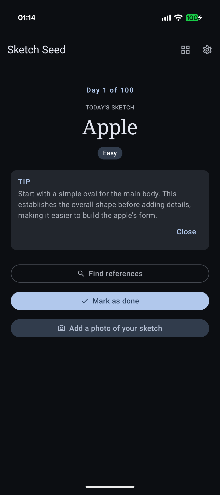
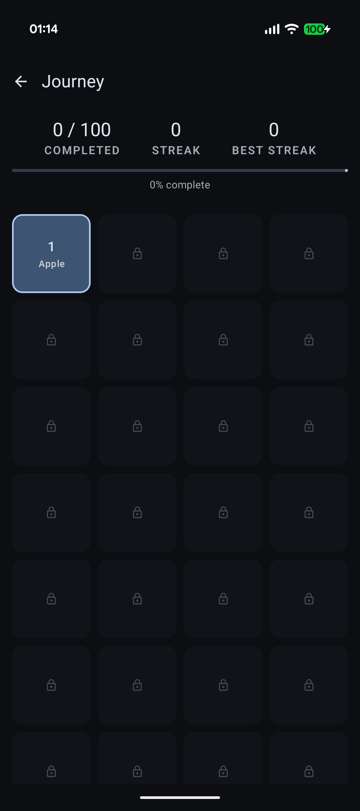
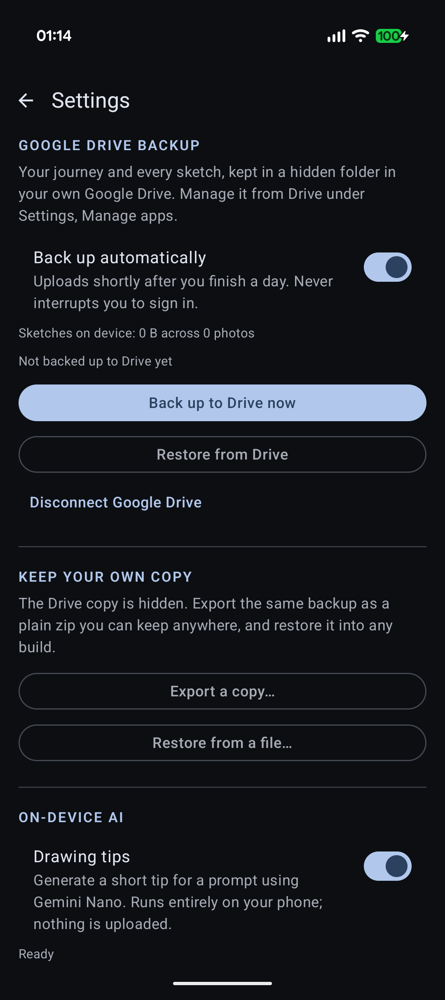

# Sketch Seed

A 100-day drawing habit app for Android. One prompt a day, revealed only when you
open the app.

The app never asks *"what do you want to draw today?"* — deciding is the part that
kills the habit. It says *"here's today's sketch"* and gets out of the way.

<p align="center">
  
  
  
</p>
<p align="center">
  <em>Today · Journey · Settings — shown on a fresh install, so the grid is still locked.</em>
</p>

## How the journey works

The day number comes from the **calendar**, not from your personal progress. Day N is
the Nth day after *your* day 1 — recorded the first time the app runs, so whenever you
start you start at `Apple`. Just arithmetic on a date: no server, no account, no sync.

Three ideas that look similar are deliberately kept apart:

| | What it means | What a missed day does |
|---|---|---|
| **Day 17 of 100** | What the calendar says today is | Nothing — it moves on regardless |
| **Completed** | How many you've actually finished | Nothing. Missed days stay open |
| **Streak** | Consecutive calendar days you drew | Resets to zero, permanently |

**Missed days stay open.** If you skip day 8, your streak dies — that's the point of a
streak. But day 8's prompt is still there, and you can go back and draw it whenever.
Finishing it does *not* resurrect the streak, because you genuinely didn't draw that
day; the completion is recorded against the day you actually drew it.

That also fixes joining late. Install on day 40 and days 1–39 are all sitting there
waiting, so you still get the beginner ramp instead of being dropped into
`Country Road` on your first evening.

**Nothing ahead is readable.** Days the calendar hasn't reached are locked and don't
even carry their prompt text in memory. The grid shows finished sketches, open days,
and padlocks — never a spoiler.

### Starting, and sharing

Day 1 is the day you first open the app, stored per install. That is a deliberate
choice with a real cost, and it is worth being explicit about which way it cuts:

- **Someone installing on any random day still begins at `Apple`.** They get the
  beginner ramp instead of being dropped into `Country Road` on their first evening.
- **Two people who start on different days are on different prompts.** The *order* is
  shared; the schedule is not. Install together and you stay in step; install a month
  apart and you never will.

An earlier version anchored everyone to a fixed `startDate` in `prompts.json` so any
two installs matched by date. That is still the fallback if no personal date has been
recorded, but a late installer losing the whole beginner ramp was the worse trade.

**Resetting re-anchors day 1 to today**, which is what makes it a genuine restart
rather than a wipe that leaves you stranded on day 40 with 39 days to catch up.

## What's in it

- **Today** — the day counter, the prompt, its difficulty, a reference search and
  mark-as-done. Nothing else: no streak, no progress bar, no numbers. Those live one
  tap away, because the point of this screen is that you look at it and start drawing.
- **Journey** — all 100 days as a grid of thumbnails, with every number: completed,
  current streak, best streak, and the progress bar. Tap any finished day to revisit it.
- **Day detail** — the full sketch, when you drew it, the tip if you asked for one, and
  anything extra you drew that day.
- **Settings** — reminders, Drive backup, export and import, on-device AI, and reset.

## Reference search

Each prompt searches for `"<prompt> sketch"` rather than the bare noun, which returns
line drawings you can actually follow instead of photographs. Pinterest or Google
Images, your pick.

## Capturing a sketch

Camera or gallery, chosen per sketch. Photography is delegated to whatever camera app
you already have via `ACTION_IMAGE_CAPTURE`, and the gallery route uses the system
photo picker.

Neither needs a permission — and the camera one specifically **because the app
declares no `CAMERA` permission**. The platform only starts requiring it for this
intent once an app declares it, so not declaring it is what keeps the flow
permission-free. The camera writes into a cache directory exposed through a
`FileProvider`; `PhotoStore` then downscales it into place and the temp file is
disposable.

An earlier version used the ML Kit document scanner for its auto-crop and de-skew.
That is gone: it framed sketching as document scanning, and it needed Play Services.

## On-device AI

**Gemini Nano** (`genai-prompt`, ML Kit Prompt API) generates an optional one-line
drawing tip. This is a garnish, never a dependency: the API is beta, Gemini Nano is
absent on plenty of hardware, and AICore will happily sit on a model download
indefinitely. Every stage is therefore bounded by a timeout, the UI says whether it is
*downloading the model* or *running inference* rather than showing an unqualified
spinner, and every failure resolves to "no tip". It is off the critical path of
marking a day done, and it can be switched off entirely.

The base model lives in AICore and is shared system-wide, so this app does not pull
down its own copy of Gemini Nano.

Prompt packs are hand-curated on purpose. A generated list would undermine the
difficulty ramp, which is the one thing a 100-day journey actually needs.

## Backup

A zip of the journey and every sketch, kept in a hidden folder in your own Google
Drive, uploaded shortly after you finish a day.

Android Auto Backup is deliberately **off** (`allowBackup="false"`). It looked like the
cheaper option — no account, no code — but it caps at 25 MB and silently drops
everything past it, it resets whenever the signing key changes, and the user can
neither trigger it nor see whether it worked.

Backed up: journey progress, which prompt was drawn on which day, completion dates,
streak history, and every sketch photo — including the extras.

Two things make it recoverable rather than merely present:

1. **One generation is kept.** A new backup renames the current one to
   `sketchseed-backup-previous.zip` before uploading. A backup that only ever holds
   the newest state is only as trustworthy as the state that produced it — anything
   that empties the journey locally would, one automatic run later, empty the backup.
2. **Restore replaces, and adopts before it deletes.** Merging two journeys would
   produce a state neither the user nor the streak maths could explain, so restore
   overwrites wholesale behind a confirmation. New sketches are copied into place
   before any old ones are removed, so an interruption leaves you with both copies
   rather than neither.

The Drive copy is hidden in `appDataFolder`, which means you cannot open or move it
yourself. **Export a copy** in Settings writes the identical zip to ordinary storage —
no account, no Drive scope, restorable into any build.

> **Signing and Drive are linked.** Authorization is granted to an OAuth client bound
> to the applicationId *and* the signing certificate. Re-sign the app with a different
> key and every Drive call fails until that certificate's SHA-1 is registered in the
> Google Cloud project. This is why the release build is signed with the debug
> certificate — see [Building](#building).

## Reminders

Three nudges a day, on by default, each at a time you set — 9am, 6pm and 10pm to
start with. Three rather than one because a single notification is easy to swipe away
and forget, and easy to miss entirely if it lands mid-meeting.

**Drawing today silences the rest of the day.** That is decided when each reminder
fires, not by cancelling anything when you finish, so it holds however the day played
out — app killed, day restored from a backup, clock rolled past midnight. The worker
asks the same question every time: is there something to draw right now?

All three slots share one notification, so a later nudge replaces an earlier unread one
instead of leaving three stacked for the same undrawn day. That only works on a
high-importance channel: at default importance the replacement made a sound but never
surfaced, which is indistinguishable from no reminder at all. Android locks a channel's
importance once created, so the channel id carries a version — raising it in place would
have reached nobody who already had the app.

WorkManager rather than exact alarms. A drawing reminder is fine arriving a few minutes
late, and this survives reboots and Doze without the exact-alarm permission Android now
guards closely. Denying the notification permission costs only the reminders; Settings
says so plainly rather than showing a toggle that looks on while nothing arrives.

Each slot is re-enqueued rather than updated in place. WorkManager fires periodic work
at `last_enqueue_time + initialDelay`, and updating preserves the original
`last_enqueue_time` — so a correctly computed delay was being measured from whenever the
slot was first created, and every reminder fired early by exactly that gap. Hours, on an
install of any age. Re-enqueueing resets the anchor, which is the only thing that makes
the time you picked the time you get.

## On-device AI, or none at all

Gemini Nano is absent on plenty of hardware. Where `TipGenerator` reports the feature
unsupported, **the nudge button and the entire On-device AI section are hidden** rather
than shown greyed out — a permanently disabled switch advertises something the device
will never do and invites prodding.

That answer is cached, because it is a fact about the hardware and cannot change while
the app runs. "Model not downloaded yet" is not cached, since a download completing
flips it.

## Extra sketches

Some prompts take a minute. A finished day can hold any number of **extra sketches**,
each with a title and an optional photo, from either the home screen or day detail.

They are deliberately inert: extras never count toward the hundred, never move the
streak, and never unlock the next day. Otherwise a fast prompt becomes a way to buy
progress, and one-a-day stops meaning anything. Unit tests pin that down.

## Tech

Single-module Kotlin app.

- Jetpack Compose + Material 3, dynamic colour where the device offers it
- DataStore + kotlinx.serialization for persistence — the whole journey is at most 100
  small records, so it is one JSON blob rather than a database. No Room, no schema
  migrations, no annotation processor.
- Coil 3 for image loading
- No authentication, no backend, no analytics

| | |
|---|---|
| minSdk | 26 (floor for the ML Kit Prompt API) |
| compileSdk / targetSdk | 36 |
| AGP / Gradle / JDK | 8.13.2 / 8.14.3 / 17 |

### Layout

```
domain/     pure Kotlin — streaks, journey rules, models (unit tested)
data/       DataStore repositories, prompt pack loading, photo storage
ai/         Gemini Nano tip generation
ui/         Compose screens, one package per screen
```

`domain/` has no Android dependencies, which is why the rules that matter — streak
maths, the reveal logic, and back-filling — are covered by fast JVM tests.

## Building

```bash
./gradlew assembleDebug
```

```bash
./gradlew testDebugUnitTest
```

Photo storage is covered by instrumented tests, because the bug they guard against
lived in `BitmapFactory`'s bounds-decoding contract, which JVM stubs don't reproduce.
These need a connected device or emulator:

```bash
./gradlew connectedDebugAndroidTest
```

Or open the project in Android Studio and run it.

### A shareable APK

```bash
./gradlew assembleRelease
```

Produces a minified ~2.9 MB APK at `app/build/outputs/apk/release/app-release.apk`,
installable by anyone who sideloads it.

It is signed with the **debug** certificate on purpose. Drive authorization is bound to
the applicationId plus a signing certificate, and the debug one is what is registered;
signing with a fresh release key authorises fine and then fails every Drive call. To
move to a real release key, generate a keystore, register its SHA-1 in the Google Cloud
project alongside the existing one, then point `signingConfigs` at it. Play will not
accept a debug-signed APK, so that step is required before publishing.

## The prompts

100 days ramping from `Apple` to `Self Portrait`. Each day is a short subject — short
because it doubles as the image-search term.

The sequence is ordered by **skill, not by subject**, which is the order the teaching
material converges on: line and shape, then proportion, then perspective, then value.

| Days | Practising |
|---|---|
| 1–14 | Line and shape confidence |
| 15–26 | Proportion and measuring |
| 27–40 | Form and ellipses |
| 41–54 | Perspective |
| 55–66 | Value and shading |
| 67–76 | Texture |
| 77–87 | Organic form and gesture |
| 88–96 | Faces |
| 97–100 | Composition |

Difficulty climbs continuously rather than in three flat blocks, and individual days
are rated on their own merits — `Bicycle Wheel` at day 49 is HARD while sitting inside
the perspective run, because a wheel is an ellipse problem most beginners lose an hour
to. Faces get ten days of runway before the finale instead of arriving cold.

They live in `app/src/main/assets/prompts.json`, alongside a `startDate` that only
applies before first launch records your own — see
[Starting, and sharing](#starting-and-sharing). Editing the prompts will not rewrite
your history: each finished day snapshots the prompt text it was drawn from.
